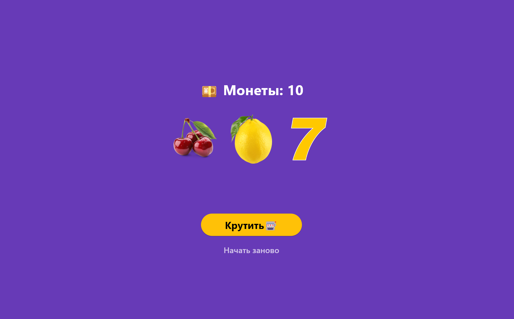

# 🎰 Слот-машина (Slot Machine)


> 🎲 Простое игровое приложение-слот на Flutter с анимацией, звуковыми эффектами и адаптивным интерфейсом.

---

## 📋 Описание

**Slot Machine** — это учебное приложение, демонстрирующее возможности Flutter для создания интерактивных интерфейсов. Приложение имитирует классический игровой автомат с тремя барабанами, системой монет и визуальными/звуковыми эффектами.

### ✨ Особенности

- 🎰 Три вращающихся барабана с плавной анимацией
- 💰 Система монет: старт с 10 монет, ставки и выигрыши
- 🔊 Звуковые эффекты: победа, джекпот, проигрыш, клик
- 🔇 Кнопка включения/выключения звука
- 📱 Адаптивный дизайн для Web и Android
- 🎨 Кастомная иконка приложения
- 🚀 Оптимизированные release-сборки

---

## 🖼️ Скриншоты

| Главный экран | Победа | Джектпот |
|--------------|--------|----------|
|  |  |  |

> 📁 Все скриншоты находятся в папке [`steps/`](steps/)

---

## 🚀 Быстрый старт

### Требования

- Flutter SDK ≥ 3.11.5
- Dart SDK ≥ 3.1.5
- Android Studio / VS Code
- Для Android: Android SDK с установленными лицензиями
- Для Web: браузер на базе Chromium

### Установка зависимостей

```bash
flutter pub get
```

### Запуск приложения

**🌐 Web (Chrome):**
```bash
flutter run -d chrome
```

**🤖 Android (эмулятор/устройство):**
```bash
flutter devices          # проверить подключенные устройства
flutter run -d <device_id>
```

---

## 📦 Сборка релизных версий

### 🌐 Web

```bash
flutter build web --release
```

Результат: `build/web/`  
Можно задеплоить на **GitHub Pages**, **Netlify**, **Vercel** или любой статический хостинг.

### 🤖 Android

```bash
flutter build apk --release
```

Результат: `build/app/outputs/flutter-apk/app-release.apk`

> 💡 Для первой сборки может потребоваться принять лицензии Android:
> ```bash
> flutter doctor --android-licenses
> ```

---

## 🗂️ Структура проекта

```
lib/
├── main.dart              # Точка входа, инициализация сервиса
├── slot_machine.dart      # Основной виджет игры
├── slot_row.dart          # Виджет ряда барабанов
├── sound_service.dart     # Сервис управления звуком (audioplayers)
└── ...

assets/
├── images/
│   ├── cherry.png
│   ├── lemon.png
│   └── seven.png
├── sounds/
│   ├── background.mp3
│   ├── win.mp3
│   ├── lose.mp3
│   ├── jackpot.mp3
│   └── click.mp3
└── icon/
    └── app_icon.png       # Иконка приложения 1024×1024

steps/                     # Скриншоты для README
├── main_screen.png
├── win.png
└── jackpot.png
```

---

## 🔧 Технологии и пакеты

| Пакет | Версия | Назначение |
|-------|--------|------------|
| `flutter` | SDK | Основной фреймворк |
| `audioplayers` | ^6.6.0 | Кроссплатформенное воспроизведение звука |
| `flutter_launcher_icons` | ^0.14.4 | Генерация иконок для Android/Web |
| `cupertino_icons` | ^1.0.8 | iOS-стиль иконок |
| `flutter_lints` | ^6.0.0 | Рекомендации по код-стайлу |

---

## 🔊 Звуковая система

Приложение использует пакет [`audioplayers`](https://pub.dev/packages/audioplayers) для воспроизведения звука на **Web** и **Android**.

### Особенности реализации:

- 🎵 Фоновая музыка зациклена и воспроизводится с громкостью 40%
- 🔁 Пул из 4 `AudioPlayer` для мгновенного воспроизведения эффектов
- 🔇 Глобальное управление mute/unmute через `SoundService`
- ⚡ Низкая задержка благодаря `PlayerMode.lowLatency`

### API сервиса:

```dart
// Инициализация (в main)
await SoundService.init();

// Управление
SoundService.playBackground();     // фоновая музыка
SoundService.playWin();            // звук победы
SoundService.playJackpot();        // джекпот
SoundService.playLose();           // проигрыш
SoundService.playClick();          // клик
await SoundService.toggleMute();   // вкл/выкл звук
bool muted = SoundService.isMuted; // проверка состояния
```

> ⚠️ На современных браузерах звук воспроизводится **только после первого взаимодействия** пользователя со страницей (политика автовоспроизведения).

---

## 🎨 Иконка приложения

Иконка создана в **Krita** (1024×1024 PNG) и сгенерирована для всех платформ через `flutter_launcher_icons`.

### Конфигурация (`pubspec.yaml`):
```yaml
flutter_launcher_icons:
  android: true
  ios: false
  web:
    generate: true
    image_path: "assets/icon/app_icon.png"
  image_path: "assets/icon/app_icon.png"
  min_sdk_android: 25
```

### Генерация иконок:
```bash
dart run flutter_launcher_icons
```

---

## 📝 Лицензия

Этот проект распространяется под лицензией **MIT**. Подробнее см. в файле [LICENSE](LICENSE).

```
MIT License

Copyright (c) 2026 Dimit

Permission is hereby granted, free of charge, to any person obtaining a copy
of this software and associated documentation files (the "Software"), to deal
in the Software without restriction, including without limitation the rights
to use, copy, modify, merge, publish, distribute, sublicense, and/or sell
copies of the Software, and to permit persons to whom the Software is
furnished to do so, subject to the following conditions:

The above copyright notice and this permission notice shall be included in all
copies or substantial portions of the Software.
```

---

## 👨‍💻 Автор

**SDA** — студент ISP-232, разработчик Flutter-приложений
Лабораторная работа №7


> 🎓 Проект выполнен в рамках лабораторной работы №7 по мобильной разработке.

---

## 🤝 Вклад в проект

1. Fork репозитория
2. Создайте ветку (`git checkout -b feature/AmazingFeature`)
3. Закоммитьте изменения (`git commit -m 'Add some AmazingFeature'`)
4. Запушьте ветку (`git push origin feature/AmazingFeature`)
5. Откройте Pull Request

---

